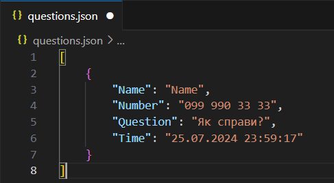
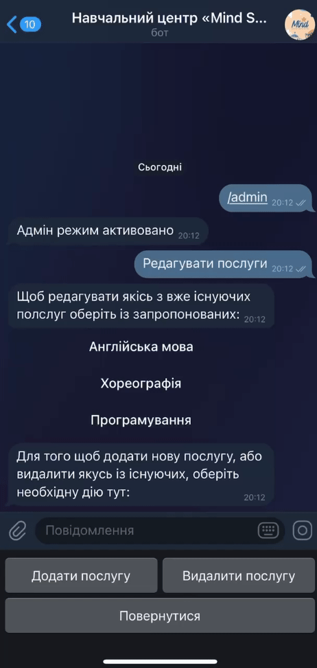
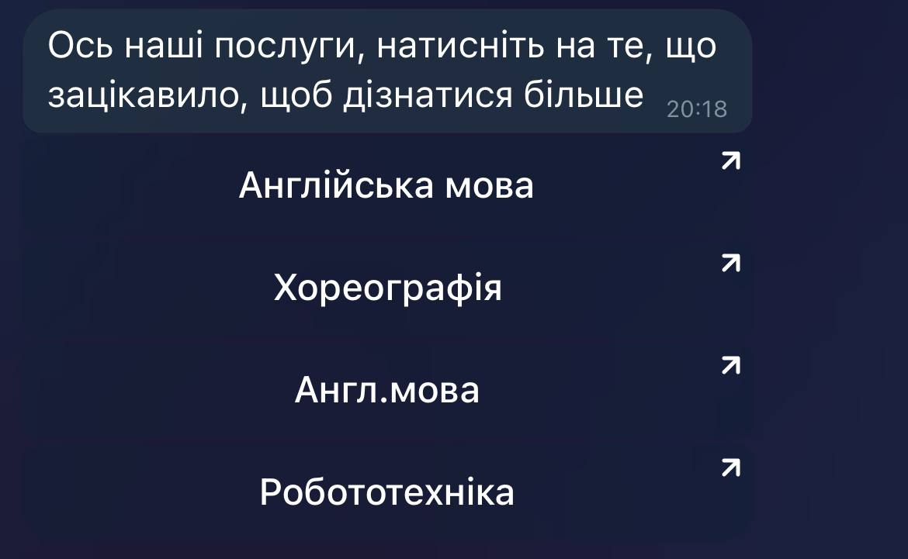
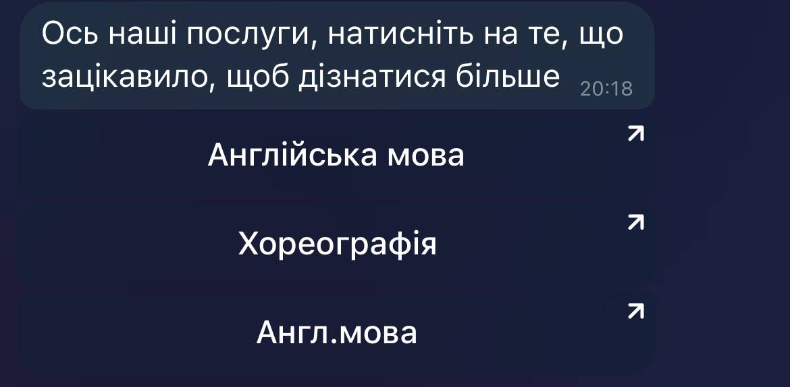
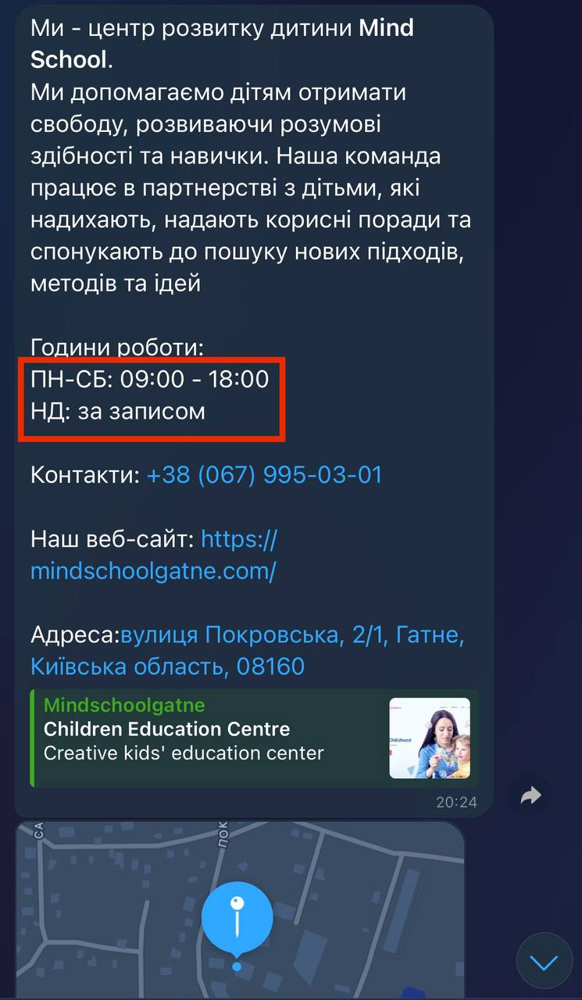
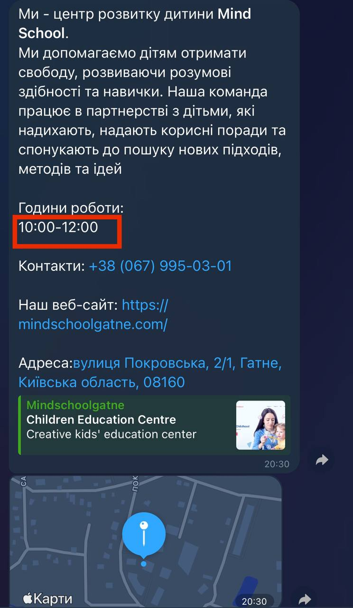

# Mind School Telegram Bot

## Що це?

Це проект Telegram чат-боту для навчального центру Mind School. Призначений для автоматизованого менеджменту клієнтів з платформи Telegram, зокрема збір та обробка клієнтських даних, можливість цілодобово реалізовувати перелік послуг, забезпечення цілодобового callback-контакту з клієнтами.

## Як це працює

### Користувацькі функції

Після ініціалізації чату з ботом користувачу надається можливість реалізувати три функції:
- Переглянути перелік послуг
- Задати питання
- Дізнатися інформацію про центр

#### Переглянути перелік послуг

Після натискання відповідної клавіші користувачу прийде повідомлення з переліком послуг у вигляді Inline-кнопок. При натисканні на кнопку користувачу відкривається відповідна сторінка сервісу Telegrahp (telegra.ph) з описом послуги. Ці сторінки створюються та редагуються SMM-менеджерами. В цьому документі буде прикріплене посилання на CRM-систему, де користувач може безпосередньо записатися на заняття. Цим забезпечується реалізація та організація клієнт-менеджменту цілодобово та без фактичної участі менеджерів у спілкуванні.

#### Задати питання

Натиснувши кнопку "Задати питання" в користувача запитується ім'я та номер телефону, після чого користувач пише своє питання. Ці питання разом з ім'ям, номером та id- користувача зберігаються в окремому файлі, тому питання можна задати в будь-який час доби та в будь-який день. Відповідь адміністратор може надати в робочий (або ж в зручний для адміна) час. Це забезпечує спілкування в зручний і для користувача, і для менеджера спосіб.

#

#### Дізнатися інформацію про центр

Кнопка "Про нас" надсилає повідомлення з коротким описом навчального центру, контактні номери телефону, робочі години, адресу з гіперпосиланням на сторінку закладу у сервісі Google Maps, а також прикріплює карту з вказаною адресою. Це дозволяє зменшити кількість маніпуляцій користувачем для отримання відповідної інформації, а також покращити універсальність для різних систем та сервісів. Крім того, дана інформація зберігається в окремому файлі, що забезпечує необхідну відмовостійкість.

### Функції адміністратора

Адміністратор даного бота має необхідні функції для менеджменту більшої частини його функціоналу. Це забезпечує підвищену гнучкість та адаптивність системи, а також більшу автономність від послуг технічного спеціаліста для виконання задач нетехнічного характеру. Адміністратор в своєму розпорядженні такі інструменти:

- Редагувати послуги
  - Додавати нові послуги
  - Видаляти існуючі послуги
  - Зміна назви чи опису вже існуючих послуг
- Редагувати інформацію з розділу "Про нас"
  - Змінювати опис
  - Змінювати контактні номери телефону
  - Змінювати посилання на сторінку компанії в Google Maps
  - Змінювати посилання на веб-сайт компанії
  - Змінювати вказану адресу

Авторизація в якості адміністратора відбувається через команду /admin.

Так як всі робочі комунікації відбуваються з робочого Telegram-аккаунту, то і інструментарій адміністратора доступний лише для робочого аккаунта. Якщо Ви спробуєте авторизуватися не з робочого аккаунту, то доступ Вам не відкриється, натомість прийде наступне повідомлення:

Дані робочого аккаунту зберігаються в окремому файлі, що забезпечує стійкість до збоїв роботи хоста.

Після авторизації буде ініціалізоване меню Keyboard-кнопок "Редагувати послуги" та "Редагувати 'Про нас'"

#### Редагувати послуги

У адміністратора є можливість редагувати послуги, що відображаються клієнту. Він може додавати нові, видаляти та змінювати існуючі послуги. Так як представлення послуг реалізується через меню Inline-кнопок з посиланням на описові сторінки, то об'єктами редагування є назва кнопки та URL-посилання.

Після натискання кнопки "Редагувати послуги" відобразиться перелік Inline-кнопок для зміни існуючих послуг та три Keyboard-кнопки: "Додати послугу", "Видалити послугу" та "Повернутися".

##### Редагування існуючих послуг

Після відображення меню з переліком послуг для редагування Ви можете обрати яку саме ви хочете змінити натисканням на відповідну кнопку. Далі у Вас відобразиться повідомлення з уточненням вибраної послуги та двома Inline-кнопками: "Змінити назву" та "Змінити опис"

Далі натисканням на відповідну кнопку Ви можете змінити те, що хочете. Після натискання бот попросить Вас ввести в залежності від Вашого вибору або нову назву, або URL-посилання на описову сторінку.

#

##### Додавання нових послуг та видалення існуючих послуг

Щоб додати нову послугу Ви маєте натиснути відповідну кнопку. Далі у Вас запитає назву та URL-посилання на описову сторінку. Після цього прийде повідомлення з уточненням яку саме послугу Ви додали.

#

Видалення існуючих функцій відбувається ще простіше, так як для цього треба натиснути відповідну кнопку та ввести назву послуги яку хочете видалити.

#

#### Редагувати інформацію з розділу "Про нас"

Ще однією можливістю адміністратора є зміна інформації з розділу "Про нас". Адмін може змінювати всі дані що надсилаються при відповідному запиті користувача, але адмін не може змінити будову подачі інформації. Щоб редагувати інформацію з розділу "Про нас" необхідно натиснути відповідну кнопку, після чого висвітиться меню Inline-кнопок з переліком даних, які Ви можете змінити.

Обравши необхідне поле бот попросить Вас ввести нов

у інформацію. Поля нічим не обмежені, тож зміни Ви можете вносити будь-які. Вони зберігатимуться в окремому файлі, тому вся система є повністю відмовостійкою.

#

#

